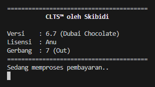

# Simulasi Sistem Ticketing Commuter Line

Repositori ini dibuat dalam rangka pemenuhan tugas besar pertama mata kuliah "Berpikir Komputasional".

Berikut adalah anggota kelompok kami:
1. Fachry Azriel Fajdwani (19625027)
2. Christopherus Michael J. T. (19625099)
3. Muhammad Reffah (19625103)
4. Cakrawangsa C. A. L. (19625235)

### Overview Aplikasi
Aplikasi ini akan mensimulasikan beberapa proses yang dilakukan ketika menggunakan transportasi Commuter Line berdasarkan jarak (artinya, stasiun turun tidak ditentukan). 

Beberapa proses yang disimulasikan adalah
1. Tap-in
2. Pemilihan stasiun dan arah (dilakukan sistem)
3. Tracking penumpang
4. Tap-out
5. Pembayaran dan penampilan historis perjalanan

### Preview Aplikasi
Beberapa pratinjau aplikasi sesuai dengan apa yang disimulasikan.

 
Tap-in

 

 
Penentuan tujuan dan arah

 

 
Tracking penumpang

 

 
Konfirmasi turun

 

 
Tap-out

 

 
Historis perjalanan (pembayaran gagal)

 

 
Historis perjalanan (pembayaran sukses)

 